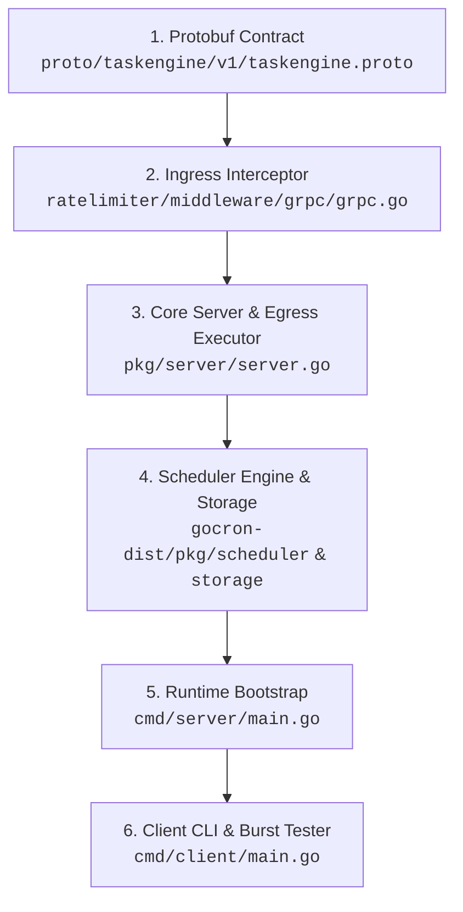
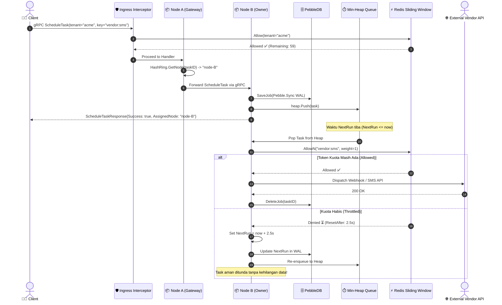

# 🎯 TaskEngine: Interview Playbook & Technical Blueprint
## *Distributed Rate-Limited Task Scheduler & Outbox Engine*

> Dokumen ini dirancang khusus sebagai panduan **Technical Blueprint & System Design Interview** tingkat Senior/Lead Backend & Distributed Systems Engineer.

---

## 📌 DAFTAR ISI
1. [Elevator Pitch (30 Detik & 2 Menit)](#1-elevator-pitch)
2. [Peta Navigasi Kode](#2-peta-navigasi-kode)
3. [Arsitektur Inti: Dual-Sided Rate Limiting](#3-arsitektur-inti-dual-sided-rate-limiting)
4. [Alur End-to-End & Sequence Diagram](#4-alur-end-to-end--sequence-diagram)
5. [Bedah Komponen Teknis](#5-bedah-komponen-teknis)
6. [Antisipasi Pertanyaan Wawancara (Q&A Level Senior)](#6-antisipasi-pertanyaan-wawancara-qa-level-senior)
7. [Analisis Trade-Off Arsitektural](#7-analisis-trade-off-arsitektural)
8. [Roadmap Skalabilitas ke 50 Juta Task/Hari](#8-roadmap-skalabilitas-ke-50-juta-taskhari)
9. [Kamus Istilah Kunci (Keywords to Drop)](#9-kamus-istilah-kunci-interview)

---

## 1. Elevator Pitch

### ⚡ Versi 30 Detik (Singkat & Tajam)
> *"Saya merancang **TaskEngine**, sebuah platform distributed task scheduling berbasis gRPC dengan pendekatan **Dual-Sided Rate Limiting**. Sistem ini memadukan **SWIM Gossip protocol (Memberlist)** dan **Consistent Hashing** untuk sharding peer-to-peer tanpa SPOF, **PebbleDB (LSM-Tree)** untuk durabilitas disk tanpa kehilangan data, serta algoritma **Sliding Window Counter di Redis via Lua scripting** untuk melindungi API di sisi ingress (mencegah abuse client) sekaligus melakukan **adaptive pacing di sisi egress** agar ribuan background job yang jatuh tempo bersamaan tidak men-DDoS API pihak ketiga seperti OpenAI, Stripe, atau Twilio."*

### 🎙️ Versi 2 Menit (Structured STAR Approach)
* **Situation**: Dalam sistem skala besar (seperti event-driven microservices atau outbox pattern), penjadwalan task menghadapi dua dilema besar:
  1. *Ingress Abuse*: Klien atau tenant yang tidak disiplin dapat membanjiri scheduler dengan jutaan task, memicu kehabisan memori atau resource starvation.
  2. *Egress Throttling Breakdown*: Ketika ribuan task jatuh tempo pada detik yang sama (misal pukul 09:00:00), scheduler menembak third-party vendor secara bersamaan. Akibatnya, sistem menerima badai `HTTP 429 Too Many Requests`, kuota vendor habis, atau akun API di-suspend.
* **Task**: Membangun sistem terdistribusi yang otonom, tanpa master node (SPOF), yang menjamin persistensi task sekaligus mengatur laju lalu lintas task di kedua sisi (sebelum task masuk antrean dan sebelum task dieksekusi).
* **Action**:
  1. Di sisi **Ingress**, membuat **gRPC Unary Server Interceptor** yang memvalidasi kuota per-tenant secara *fail-closed* menggunakan Redis Lua Script sliding window.
  2. Di sisi **Cluster Core**, mendistribusikan kepemilikan task menggunakan **Consistent Hashing Ring (CRC32)** dan **Memberlist Gossip**. Node mana pun yang menerima request dapat mem-forward task secara transparan ke owner node. Task langsung di-`fsync` ke **PebbleDB WAL** sebelum masuk ke in-memory **Min-Heap Priority Queue**.
  3. Di sisi **Egress**, merancang **Adaptive Executor**. Saat waktu jatuh tempo tiba, engine mengecek ketersediaan token target via `ratelimiter.AllowN()`. Jika kuota habis, task **tidak di-drop**, melainkan di-requeue otomatis ke masa depan (`NextRun = now + ResetAfter`) dengan backoff dinamis.
* **Result**: Sistem mampu memproses ribuan task terjadwal dengan latensi sub-milidetik, toleran terhadap kegagalan node, dan secara cerdas melunakkan lonjakan trafik (*traffic smoothing*) ke API pihak ketiga tanpa ada satupun task yang hilang.

---

## 2. Peta Navigasi Kode



---

## 3. Arsitektur Inti: Dual-Sided Rate Limiting

Kebanyakan sistem rate limiting di industri hanya dipasang di sisi pintu masuk API (API Gateway Ingress). **Kekuatan utama TaskEngine adalah proteksi dua arah:**

| Aspek | Ingress Rate Limiting | Egress Adaptive Throttling |
|---|---|---|
| **Titik Eksekusi** | gRPC Unary Server Interceptor | Scheduler Engine `Executor` callback |
| **Identitas Kunci (`Key`)** | `tenant_id` (diambil dari metadata `x-tenant-id`) | `rate_limit_key` (misal `vendor:openai`, `endpoint:whatsapp`) |
| **Aksi Jika Melebihi Kuota** | Tolak request dengan `codes.ResourceExhausted` (HTTP 429) | **Tunda eksekusi (Defer)**, hitung backoff, dan jadwalkan ulang ke masa depan |
| **Dampak Kegagalan** | Mencegah scheduler cluster kehabisan memori akibat spam klien | Menghindari IP ban dan penolakan 429 dari API pihak ketiga |
| **Kehilangan Data** | 0% (Client diminta retry di sisi caller) | 0% (Task tetap tersimpan aman di PebbleDB) |

---

## 4. Alur End-to-End & Sequence Diagram



---

## 5. Bedah Komponen Teknis

### 5.1. Ingress Interceptor (`ratelimiter/middleware/grpc`)
- Beroperasi sebagai middleware standar gRPC:
  ```go
  interceptor := ratelimit_grpc.RateLimiter(
      ingressLimiter,
      ratelimit_grpc.KeyFromMetadata("x-tenant-id", "default-tenant"),
  )
  ```
- Menyisipkan informasi kuota ke dalam trailing metadata gRPC:
  - `x-ratelimit-limit`
  - `x-ratelimit-remaining`
  - `x-ratelimit-reset`
- Mengembalikan kode standar gRPC `codes.ResourceExhausted` jika kuota tenant habis.

### 5.2. Consistent Hashing & Smart Gateway
- Menggunakan 32-bit CRC32 hash ring.
- Memungkinkan klien melakukan request ke sembarang node (anycast ingress).
- Node yang menerima request akan memeriksa ring:
  - Jika pemilik lokal -> eksekusi & simpan ke database lokal.
  - Jika pemilik remote -> resolve alamat gRPC pemilik via Memberlist metadata dan forward request dengan timeout context.

### 5.3. Egress Adaptive Rate-Limiter (`pkg/server/server.go`)
- Disematkan ke dalam lifecycle scheduler engine melalui callback:
  ```go
  func (s *Server) ExecuteTask(ctx context.Context, j *scheduler.Job) error
  ```
- Mengecek ketersediaan token untuk `j.RateLimitKey` dengan bobot `j.Weight`.
- Jika `res.Allowed == false`, task tidak pernah dihapus atau dibatalkan. Task di-reschedule secara deterministik berdasarkan `res.ResetAfter`.

### 5.4. Crash Recovery & Durability
- Task disimpan di **PebbleDB** dengan opsi `pebble.Sync` sebelum masuk ke memori min-heap.
- Ketika server restart, fungsi recovery memuat kembali semua pending tasks dari PebbleDB ke heap in-memory.

---

## 6. Antisipasi Pertanyaan Wawancara (Q&A Level Senior)

### ❓ Q1: "Mengapa kamu membedakan rate limiter di ingress dan egress? Bukankah cukup di ingress saja?"
💡 **Jawaban Standout:**
> *"Rate limit di sisi ingress hanya melindungi server kita sendiri dari flood client. Namun, dalam sistem asynchronous task scheduler, waktu submit task berbeda dengan waktu eksekusi task.*
> *Misalnya, 1.000 client berbeda masing-masing menjadwalkan 1 task untuk dieksekusi tepat tengah malam (00:00:00) yang semuanya memanggil endpoint LLM OpenAI.*
> *Di sisi ingress, semua lolos karena masing-masing tenant hanya mengirim 1 request. Namun pada pukul 00:00:00, jika kita tidak memiliki Egress Throttling, scheduler akan menembak 1.000 request sekaligus ke OpenAI dalam hitungan milidetik, menyebabkan akun kita terkena HTTP 429 atau ban.*
> *Dengan Egress Adaptive Throttling di TaskEngine, scheduler secara otonom mengatur laju dispatch sesuai kecepatan konsumsi downstream vendor."*

---

### ❓ Q2: "Bagaimana jika Redis mati? Apa strategi fallback-nya?"
💡 **Jawaban Standout:**
> *"Kita menerapkan strategi yang berbeda untuk Ingress dan Egress:*
> 1. *Untuk **Ingress**, kita menggunakan prinsip **Fail-Closed**: jika Redis mati, kita menolak task baru dengan error status 500/Unavailable demi menjaga integritas memori node.*
> 2. *Untuk **Egress**, jika Redis tidak merespons, kita menerapkan **Circuit Breaker & Exponential Backoff**: task tidak langsung di-drop, melainkan di-defer sementara (misal 5 detik). Selain itu, kita dapat menyematkan **in-memory token bucket lokal** sebagai fallback degradation.*
> *Pada production, Redis harus dikonfigurasi dengan Redis Sentinel atau Redis Cluster multi-AZ untuk high availability."*

---

### ❓ Q3: "Bagaimana sistem mencegah thundering herd problem saat window reset?"
💡 **Jawaban Standout:**
> *"Jika 100 task sama-sama di-defer dan diatur jatuh tempo pada detik yang sama (`now + ResetAfter`), mereka akan terbangun bersamaan dan berebut kuota lagi (*thundering herd*).*
> *Untuk mengatasinya, kita menambahkan **Full Jitter**:*
> $$\text{Backoff} = \text{ResetAfter} + \text{RandomUniform}(0, \text{JitterMax})$$
> *Dengan mendistribusikan waktu bangun task dalam rentang beberapa ratus milidetik, kita mengubah lonjakan impulsif menjadi aliran trafik yang stabil dan merata."*

---

### ❓ Q4: "Apa jaminan delivery sistem ini? Bagaimana jika node crash saat mengeksekusi payload?"
💡 **Jawaban Standout:**
> *"TaskEngine memberikan garansi **At-Least-Once Delivery**.*
> *- Task baru dihapus dari PebbleDB **setelah** fungsi eksekusi payload selesai dengan sukses.*
> *- Jika node mati saat payload sedang berlangsung atau jaringan terputus sebelum penghapusan disk selesai, saat node bangkit kembali, task tersebut akan dimuat ulang dari PebbleDB dan dieksekusi kembali.*
> *- Oleh karena itu, kita mewajibkan payload task bersifat **Idempotent** (misalnya menggunakan Deduplication Key atau database conditional write)."*

---

### ❓ Q5: "Mengapa menggunakan Consistent Hashing dibanding message queue terpusat seperti RabbitMQ atau Kafka?"
💡 **Jawaban Standout:**
> *"RabbitMQ dan Kafka sangat bagus untuk streaming dan message queue standar, namun memiliki tantangan untuk **arbitrary delayed scheduling** (misal eksekusi task tepat pada T+3 hari 4 jam 12 menit):*
> *- Kafka tidak dirancang untuk min-heap delay ordering tanpa DLQ/re-queueing yang rumit.*
> *- RabbitMQ dead-lettering dengan TTL memiliki masalah head-of-line blocking jika pesan terdepan memiliki TTL lebih panjang.*
> *- Dengan Consistent Hashing P2P dan Min-Heap in-memory berdurabilitas PebbleDB, TaskEngine memberikan pencarian jatuh tempo $O(1)$ peek dan $O(\log N)$ insert tanpa external broker."*

---

## 7. Analisis Trade-Off Arsitektural

| Komponen | Pilihan TaskEngine | Alternatif Populer | Trade-Off & Justifikasi |
|---|---|---|---|
| **Rate Limit Algorithm** | Sliding Window Counter (Redis ZSET) | Token Bucket / Leaky Bucket | Sliding Window menghilangkan kerentanan double-burst di batas window dan mendukung operasi atomic inspect (`Status`) serta weighted request (`AllowN`). Trade-off: $O(N)$ memory per key di Redis dibanding $O(1)$. |
| **Inter-Node Routing** | Anycast + Consistent Hash Forwarding | Centralized Load Balancer / API Gateway | Memungkinkan cluster beroperasi secara simetris tanpa ketergantungan pada load balancer eksternal yang kompleks. |
| **Node Discovery** | SWIM Gossip (Memberlist) | Raft / etcd / Consul | Peer-to-peer tanpa leader bottleneck, sangat cepat mendeteksi node crash. Trade-off: Eventual consistency vs strict linearizability. |
| **Persistence** | PebbleDB (LSM-Tree) | PostgreSQL / SQLite (B-Tree) | Sequential write append dengan throughput sangat tinggi dan latency write sub-milidetik. Trade-off: Embedded di node lokal, belum ada cross-node disk replication. |

---

## 8. Roadmap Skalabilitas ke 50 Juta Task/Hari

1. **Virtual Nodes (Vnodes) pada Ring**:
   - Menambahkan 150-250 vnodes per physical server untuk menghilangkan data skewing.
2. **Tiered Storage (Hot vs Cold Heap)**:
   - Tidak memuat seluruh 50 juta task ke dalam memory heap Go sekaligus (mencegah OOM dan GC pause).
   - Membagi ke dalam **Cold Storage** (semua task di PebbleDB) dan **Hot Execution Window** (hanya task yang jatuh tempo dalam $\le 15$ menit yang di-push ke Min-Heap).
3. **Cross-Node Quorum Replication ($N=3$)**:
   - Setiap task direplikasikan ke 3 node suksesor di ring, sehingga jika 1 node terbakar total, task tetap dapat dieksekusi oleh replica node berikutnya.
4. **Sliding Window Counter Approximation**:
   - Untuk rate limit dengan kapasitas ekstrem (jutaan request per detik), beralih dari ZSET ke pendekatan estimasi counter berbobot persentase demi efisiensi memori $O(1)$.

---

## 9. Kamus Istilah Kunci (Interview)

- **"Dual-Sided Rate Limiting"**: Proteksi terintegrasi pada Ingress (API cluster) dan Egress (downstream execution).
- **"Adaptive Egress Throttling"**: Mekanisme penundaan task secara otomatis tanpa drop data saat third-party kuota habis.
- **"SWIM Gossip Protocol"**: Protokol penyebaran status cluster tanpa single coordinator.
- **"Consistent Hashing CRC32 Ring"**: Algoritma pemetaan kepemilikan task deterministik dengan migrasi minimal.
- **"LSM-Tree & Write-Ahead Log (WAL)"**: Mekanisme penyimpanan PebbleDB untuk menjamin ketahanan terhadap crash.
- **"Event-Driven Dynamic Timer"**: Pola concurrency Go menggunakan `time.NewTimer` yang di-reset dinamis tanpa polling boros CPU.
- **"At-Least-Once Delivery with Consumer Idempotency"**: Filosofi toleransi kegagalan sistem terdistribusi.
