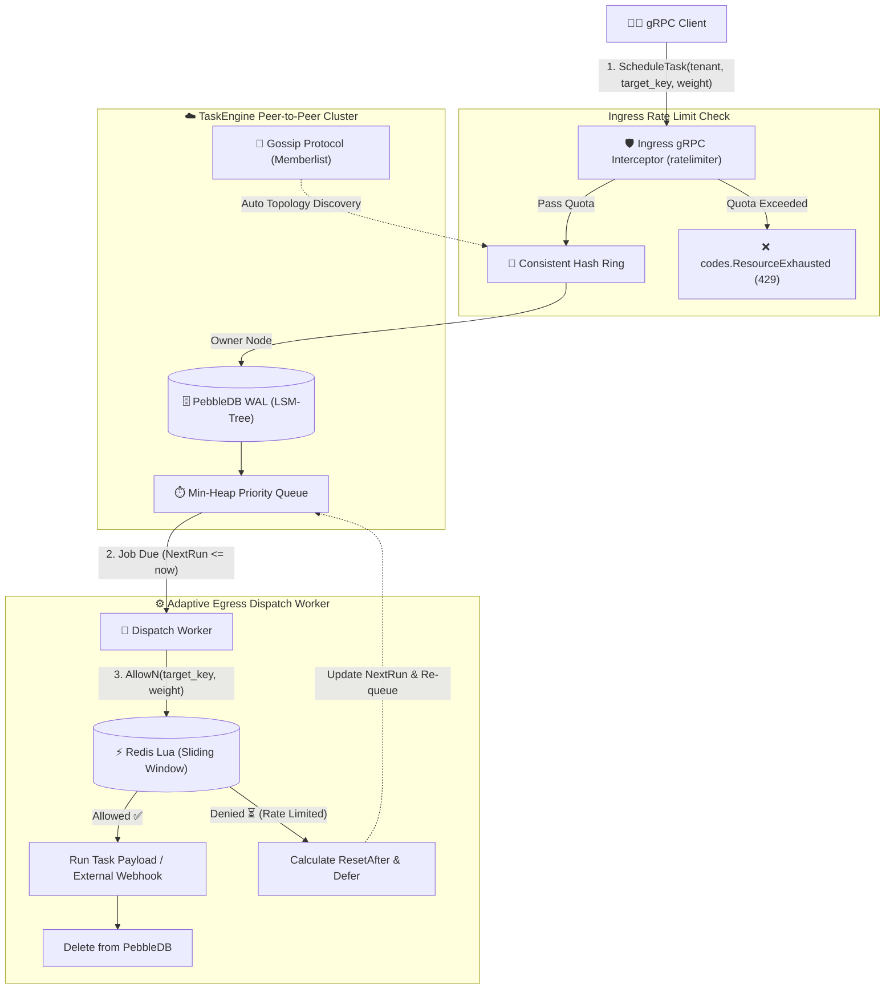

# ⚡ TaskEngine

[](https://golang.org)
[](https://grpc.io)
[](https://redis.io)
[](https://github.com/cockroachdb/pebble)
[](LICENSE)

**TaskEngine** is a high-performance, peer-to-peer distributed task scheduler with **dual-sided rate limiting** (Ingress & Egress protection).

It unites the distributed cluster architecture of [`gocron-dist`](file:///home/vnmchuo-vnmchuo/Works/workspaces/go/personal/gocron-dist) and the atomic sliding-window algorithm of [`ratelimiter`](file:///home/vnmchuo-vnmchuo/Works/workspaces/go/personal/ratelimiter) into a single production-grade gRPC platform.

---

## 🎯 The Core Problem Solved

Traditional schedulers fire tasks blindly when due time arrives. In modern microservice architectures, this causes two critical issues:

1. **Scheduler Overload (Ingress Abuse)**: Malicious or misbehaving clients flood the scheduler with millions of `ScheduleTask` requests, causing resource starvation or memory exhaustion.
2. **Downstream API Exhaustion (Egress Throttling)**: Background jobs often invoke rate-limited third-party APIs (e.g., Stripe, Twilio SMS, OpenAI, external webhooks). When thousands of scheduled jobs trigger simultaneously at 09:00:00, they overwhelm downstream systems, causing cascading `HTTP 429 Too Many Requests` or account bans.

**TaskEngine solves both sides:**
- **Ingress Protection**: gRPC Unary Server Interceptor enforces per-tenant request quotas before tasks enter the cluster.
- **Egress Adaptive Pacing**: When scheduled jobs are due, the scheduler checks token availability via Redis sliding window counter before dispatching. If rate-limited, the task is **never dropped**—it is deferred with dynamic backoff until the quota window resets!

---

## 🏗️ Architecture & Workflow



---

## 🚀 Key Features

* **Peer-to-Peer Autonomous Clustering**: No single-point-of-failure (SPOF). Nodes discover each other dynamically via **SWIM Gossip Protocol** ([Memberlist](https://github.com/hashicorp/memberlist)).
* **Deterministic Request Routing**: Uses **Consistent Hashing (CRC32 Ring)** to partition task ownership. Any node acts as an ingress gateway and forwards requests transparently.
* **Storage Durability**: Writes are persisted to **PebbleDB (LSM-Tree)** with `fsync` before memory enqueuing, ensuring zero task loss across node restarts.
* **Sub-Millisecond Event Loop**: Scheduler uses Go dynamic timers (`time.NewTimer`) and event notification channels instead of wasteful database polling.
* **Dual-Sided Rate Limiting**:
  - **Ingress**: Protects cluster API with tenant-level rate limiting (`X-RateLimit-*` gRPC trailers).
  - **Egress**: Protects third-party targets (`AllowN` weighted requests) with automatic backoff and rescheduling.
* **Zero External Dependencies Required for Dev**: Built-in fallback to embedded `miniredis` when no external Redis server is found.

---

## 📦 Project Structure

```
taskengine/
├── cmd/
│   ├── client/
│   │   └── main.go           # Rich CLI client for scheduling & burst testing
│   └── server/
│       └── main.go           # Node daemon entrypoint
├── pkg/
│   └── server/
│       ├── server.go         # Core gRPC server & adaptive egress executor
│       └── server_test.go    # Unit & integration tests with miniredis
├── proto/
│   └── taskengine/v1/
│       ├── taskengine.proto  # Protobuf service & message contracts
│       ├── taskengine.pb.go
│       └── taskengine_grpc.pb.go
├── README.md                 # Project documentation
└── go.mod
```

---

## 🛠️ Quick Start

### 1. Build Binaries

```bash
cd taskengine
go build -o bin/server ./cmd/server
go build -o bin/client ./cmd/client
```

### 2. Start a Cluster

Start Node 1 (starts embedded Redis fallback automatically if no local Redis):
```bash
./bin/server -name node-1 -port 8001 -grpc-port 9001
```

Start Node 2 and join the cluster:
```bash
./bin/server -name node-2 -port 8002 -grpc-port 9002 -join localhost:8001
```

---

## 🧑‍💻 Using the Client CLI

### A. Schedule a Single Task
```bash
./bin/client schedule -target localhost:9001 -id task-1 -tenant acme -key vendor:openai -delay 2 -msg "Generate report"
```

### B. Demonstrate Ingress Rate Limiting (Burst Abuse)
Send 20 rapid requests under tenant `spammer-tenant` to observe `codes.ResourceExhausted`:
```bash
./bin/client burst-ingress -target localhost:9001 -tenant spammer-tenant -count 20
```

### C. Demonstrate Egress Adaptive Throttling (Third-Party Protection)
Submit 8 tasks scheduled immediately targeting the same external API key `vendor:sms`:
```bash
./bin/client burst-egress -target localhost:9001 -key vendor:sms -count 8
```
**Observe the server terminal:**
1. Tasks within the quota execute immediately.
2. Tasks exceeding the quota are logged with `[Egress Throttled ⏳]`, deferred with dynamic backoff, and automatically executed when the rate limit window rolls over. Zero tasks are lost!

### D. Inspect Quota without Consuming Tokens
```bash
./bin/client quota -target localhost:9001 -key vendor:sms
```

### E. Check Task Status
```bash
./bin/client status -target localhost:9001 -id task-1
```

---

## 🧪 Running Tests

```bash
cd taskengine
go test -v ./pkg/server
```

---

## 📄 License

Distributed under the MIT License. See `LICENSE` for details.
